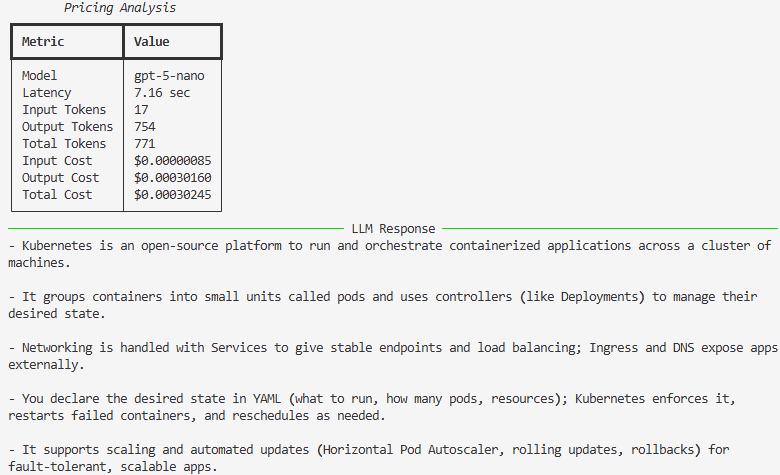

# Pricing

> **Estimated Reading Time:** 10 minutes

> **Difficulty:** ⭐⭐☆☆☆ Beginner

> **Audience:** Software Engineers, Platform Engineers, AI Engineers, Engineering Managers

> **Prerequisites:**
>
> - 01 Token Usage
> - Basic understanding of LLM tokens

---

# Overview

After measuring token usage, the next logical engineering question is:

**"How much does an LLM request actually cost?"**

Most commercial LLM providers bill independently for input and output tokens. Consequently, the total cost of an AI application depends not only on the number of requests, but also on the volume of tokens processed.

Understanding pricing is essential for designing AI systems that remain economically sustainable as usage grows.

---

# Engineering Question

**How can engineering teams estimate the cost of every LLM request using token usage metadata?**

---

# Why This Matters

Enterprise AI adoption often begins with a successful proof of concept.

As adoption increases, however, technical questions quickly become financial questions.

Engineering teams need visibility into:

- Cost per request
- Cost per application
- Cost per business service
- Daily AI spend
- Monthly AI spend
- Cost trends over time

Without these measurements, organizations cannot effectively forecast budgets or optimize AI workloads.

---

# Pricing Model

Most LLM providers price requests using two independent components.

```
               LLM Request

                    │

         ┌──────────┴──────────┐

         ▼                     ▼

Input Tokens            Output Tokens

         │                     │

         ▼                     ▼

Input Pricing          Output Pricing

         └──────────┬──────────┘

                    ▼

              Total Request Cost
```

Input and output tokens are priced separately.

The total request cost is therefore calculated as:

```
Total Cost

=

Input Cost

+

Output Cost
```

---

# Program Flow

This engineering study performs the following steps.

1. Read token usage returned by the API.
2. Load model pricing.
3. Calculate input token cost.
4. Calculate output token cost.
5. Calculate total request cost.
6. Display an engineering summary.

---

# Sample Output

```
Model

GPT-5

----------------------------------

Input Tokens        58

Output Tokens       315

----------------------------------

Input Cost          $0.00072

Output Cost         $0.00473

----------------------------------

Total Cost          $0.00545
```

---

# Understanding the Results

One important observation quickly becomes apparent.

Although the prompt may contain relatively few tokens, the model often generates a much larger response.

As a result,

**output token cost is frequently higher than input token cost.**

This behaviour depends on:

- Prompt design
- Response length
- Model behaviour
- Maximum output token limit

---
## Sample Output

The following output was generated by executing the utility using the OpenAI Responses API.



---

# Engineering Observations

### Input and output tokens are billed independently.

Engineering teams should monitor both values separately rather than considering only total tokens.

---

### Response length has a significant impact on cost.

Longer responses generally increase output token consumption and therefore increase operational cost.

---

### Every engineering decision has a financial impact.

Examples include:

- Prompt design
- Model selection
- Context size
- Response length
- Retrieval strategy

Small improvements at the request level can produce substantial savings at enterprise scale.

---

# Cost Optimization Strategies

Several engineering techniques help reduce operational cost.

### Prompt Optimization

Reduce unnecessary instructions and repetitive context.

---

### Output Token Limits

Configure maximum output tokens according to business requirements.

Avoid generating information that users do not need.

---

### Model Selection

Use the smallest model capable of solving the business problem.

Larger models often provide better reasoning but at higher operational cost.

---

### Response Caching

Avoid repeated LLM requests for identical prompts whenever appropriate.

Caching can significantly reduce AI spend.

---

### Context Engineering

Provide only relevant context.

Reducing unnecessary context decreases input token consumption while often improving response quality.

---

# Production Perspective

In production environments, cost estimation should not remain a reporting exercise.

Instead, it should become part of operational monitoring.

Typical dashboards include:

- Cost per request
- Cost per application
- Cost by business unit
- Cost by AI model
- Daily spend
- Monthly spend
- Token trends

These metrics support AI FinOps initiatives and informed architectural decisions.

---

# Scaling Considerations

Consider an average request cost of:

```
$0.005
```

At different traffic levels:

| Requests / Day | Estimated Daily Cost |
|---------------:|--------------------:|
| 10,000 | $50 |
| 100,000 | $500 |
| 1,000,000 | $5,000 |

Even modest improvements in prompt efficiency can produce significant cost savings when operating at enterprise scale.

---

# Practical Use Cases

This capability supports:

- AI FinOps
- Enterprise chargeback
- Cost forecasting
- Capacity planning
- Budget monitoring
- Model benchmarking
- Executive reporting

---

# Executive Perspective

As AI adoption grows, cost becomes an architectural consideration rather than simply an operational metric.

Engineering leaders should evaluate AI solutions not only by response quality but also by the business value generated for every dollar spent.

Organizations that continuously measure and optimize AI spend are better positioned to scale AI sustainably.

---

# Key Takeaways

- Input and output tokens are billed independently.
- Output tokens often contribute the largest portion of request cost.
- Token measurement enables accurate cost estimation.
- Cost optimization begins with engineering visibility.
- AI FinOps should be considered from the beginning of an AI initiative.

---

# Related Engineering Studies

- 01_token_usage.py
- 03_model_comparison.py *(Upcoming)*

---

# Further Reading

- OpenAI Pricing
- AI FinOps Foundation
- OpenAI Responses API

---

## Future Enhancements

Future engineering studies will extend pricing analysis by exploring:

- Multi-model cost comparison
- Cost vs latency analysis
- Cost vs response quality
- AI workload optimization
- Enterprise chargeback dashboards