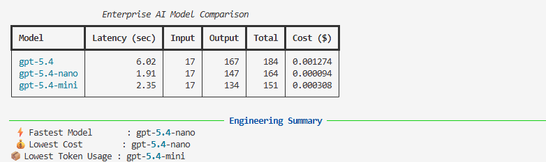

# Model Comparison

> **Estimated Reading Time:** 10 minutes

> **Difficulty:** ⭐⭐☆☆☆ Intermediate

> **Audience:** Software Engineers, Platform Engineers, AI Engineers, Enterprise Architects, Engineering Managers

> **Prerequisites:**
>
> - 01 Token Usage
> - 02 Pricing

---

# Overview

Selecting a Large Language Model is one of the most important engineering decisions when building enterprise AI applications.

While models are often compared based on reasoning ability or benchmark scores, production engineering introduces additional considerations such as latency, operational cost, token consumption, and scalability.

This engineering study compares multiple LLMs using the same prompt and measures the operational characteristics of each model.

The objective is not to determine which model is "best", but rather to understand the engineering trade-offs involved in model selection.

---

# Engineering Question

**Given the same prompt, how do different LLM models compare in terms of latency, token usage, and estimated cost?**

---

# Why This Matters

Enterprise AI platforms rarely use a single model for every workload.

Different business use cases have different priorities.

Examples include:

- Lowest operational cost
- Fastest response time
- Highest reasoning capability
- Balanced performance
- Regulatory requirements

Choosing the appropriate model requires engineering evidence rather than assumptions.

---

# Architecture

```
                    Prompt

                      │

                      ▼

          Model Benchmark Engine

                      │

      ┌───────────────┼───────────────┐

      ▼               ▼               ▼

   Model A         Model B         Model C

      │               │               │

      ▼               ▼               ▼

Latency         Token Usage        Cost

      └───────────────┼───────────────┘

                      ▼

          Engineering Comparison
```

---

# Program Flow

The program performs the following steps.

1. Read a prompt from a text file.
2. Execute the same prompt against multiple LLMs.
3. Measure request latency.
4. Capture token usage metadata.
5. Estimate request cost.
6. Display the comparison results.
7. Identify the fastest and most cost-efficient model.

---

# Sample Output

```
+--------------+----------+--------+---------+--------+----------+

Model           Latency    Input    Output    Total     Cost

-------------------------------------------------------------

GPT-5.4          3.66 s       17      120       137    $0.000921

GPT-5.4 Nano     3.22 s       17      132       149    $0.000084

GPT-5.4 Mini     1.92 s       17      135       152    $0.000310
```

Engineering Summary

```
Fastest Model

GPT-5.4 Mini

Lowest Cost

GPT-5.4 Nano

Smallest Response

GPT-5.4
```

---

## Sample Output

The following output was generated by executing the utility using the OpenAI Responses API.



---

# Engineering Observations

Several important observations emerge from this study.

### The same prompt does not produce identical token usage.

Although every model receives exactly the same prompt, the generated response length differs.

Consequently, total token consumption and operational cost also vary.

---

### Faster models are not always the least expensive.

Latency and pricing are independent engineering characteristics.

Model selection should consider both metrics together.

---

### Lower token usage does not necessarily indicate a better model.

A shorter response may reduce cost but could also omit useful information.

Engineering teams should balance response quality with operational efficiency.

---

### Model selection is an architectural decision.

Choosing an LLM is similar to selecting a database, messaging platform, or caching technology.

Different workloads may require different models.

---

# Production Perspective

Enterprise AI platforms frequently use multiple models.

Typical examples include:

- Premium models for complex reasoning.
- Lightweight models for high-volume requests.
- Specialized models for domain-specific tasks.

Model routing enables organizations to balance performance, cost, and user experience.

---

# Scaling Considerations

Consider an application processing one million requests per day.

A seemingly insignificant cost difference of a fraction of a cent per request can translate into substantial annual operational savings.

Likewise, a reduction of only a few hundred milliseconds in average response time can significantly improve user experience at scale.

Small engineering improvements often become meaningful business outcomes when multiplied across enterprise workloads.

---

# Practical Use Cases

This engineering study can support:

- Model evaluation
- AI platform design
- Cost optimization
- Capacity planning
- AI FinOps
- Technology selection
- Architecture reviews
- Proof-of-concept validation

---

# Executive Perspective

Organizations often ask:

> **"Which model should we standardize on?"**

A better question is:

> **"Which model is best suited for this specific workload?"**

There is rarely a single model that optimizes every engineering objective.

Successful enterprise AI platforms typically adopt a portfolio of models, selecting the most appropriate option based on business requirements, performance expectations, and operational cost.

---

# Key Takeaways

- Model selection should be driven by engineering evidence.
- Different models exhibit different latency, token usage, and pricing characteristics.
- Cost and performance should be evaluated together.
- Multiple models may coexist within the same enterprise AI platform.
- Benchmarking should become a regular engineering practice rather than a one-time exercise.

---

# References

- OpenAI Responses API Documentation
- OpenAI Pricing
- OpenAI Platform Documentation

---

# Future Enhancements

Future versions of this engineering study will explore:

- Parallel model execution
- CSV and Excel report generation
- Response quality evaluation
- Structured output validation
- JSON schema comparison
- Cost versus latency visualization
- Benchmark history
- AI observability dashboards
- Multi-provider benchmarking