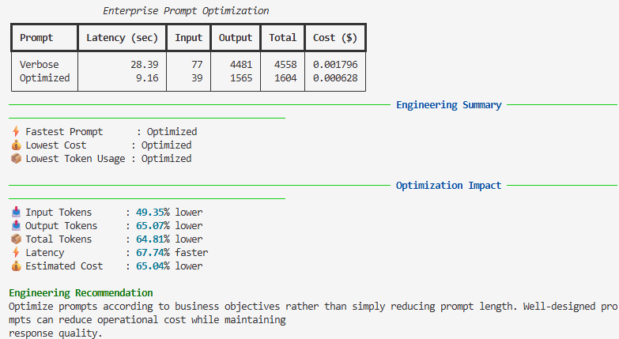

# Utility 05 — Prompt Optimization

> Optimizing prompts is not about writing fewer words—it is about expressing business requirements more precisely.

---

## Estimated Reading Time

8–10 minutes

**Difficulty:** ⭐⭐⭐☆☆ Intermediate

---

# Problem Statement

Prompt engineering is often misunderstood as simply reducing prompt length.

In reality, enterprise AI systems benefit from prompts that clearly define the business objective while avoiding unnecessary instructions that increase latency, token consumption, and operational cost.

This utility compares two prompt designs that solve the same problem and measures their engineering impact.

---

# Engineering Objective

Evaluate how prompt design influences:

- Input token consumption
- Output token generation
- End-to-end latency
- Estimated operational cost

The goal is to demonstrate that well-structured prompts can improve the efficiency of AI applications without compromising the business objective.

---

# Architecture

[Architecture diagram]

┌─────────────────────┐
│ Verbose Prompt      │
└─────────────────────┘
          │
          ▼
┌─────────────────────┐
│ OpenAI Responses API│
└─────────────────────┘
          │
          ▼
┌─────────────────────┐
│ Engineering Metrics │
└─────────────────────┘

                │
                │ Compare
                ▼

┌─────────────────────┐
│ Optimized Prompt    │
└─────────────────────┘
          │
          ▼
┌─────────────────────┐
│ OpenAI Responses API│
└─────────────────────┘
          │
          ▼
┌─────────────────────┐
│ Engineering Metrics │
└─────────────────────┘

          │
          ▼
┌──────────────────────────────────┐
│ Optimization Impact              │
│ • Tokens                         │
│ • Latency                        │
│ • Cost                           │
│ • Recommendation                 │
└──────────────────────────────────┘

# Program Workflow

1. Load two prompts from the prompts directory.
2. Invoke the OpenAI Responses API.
3. Capture latency and token usage.
4. Estimate request cost.
5. Compare engineering metrics.
6. Calculate optimization percentages.
7. Display recommendations.

---

## Sample Output

The following output was generated by executing the utility using the OpenAI Responses API.

---

# Engineering Observations

The optimized prompt reduced input tokens by approximately 49%.

More importantly, it significantly reduced output token generation because the prompt clearly constrained the expected response.

As a result, the optimized prompt also reduced latency and overall operational cost.

This demonstrates that prompt optimization is fundamentally an exercise in requirements engineering rather than simply minimizing prompt length.

---

# Business Impact

In production AI systems, prompt optimization directly affects:

- API response time
- Infrastructure utilization
- Token consumption
- Cloud expenditure
- User experience

Even modest improvements become significant when AI workloads process thousands or millions of requests each day.

---

# Production Considerations

When designing prompts for enterprise applications:

- Express the business requirement clearly.
- Avoid unnecessary context.
- Specify the desired response format.
- Constrain response length where appropriate.
- Measure the impact before deploying changes.

---

# Scaling Considerations

As AI adoption grows, prompt optimization becomes an important operational practice.

Organizations should periodically review prompts to ensure they continue to satisfy evolving business requirements while minimizing latency, token usage, and operational cost.

---

# Key Takeaways

- Prompt optimization is about clarity rather than brevity.
- Better requirements produce more focused AI responses.
- Lower token consumption generally improves latency and reduces operational cost.
- Every prompt modification should be validated using measurable engineering metrics.

---

# Engineering Summary

Prompt engineering should be treated as an engineering optimization exercise rather than a writing exercise.

Well-defined business requirements enable Large Language Models to generate responses that are faster, more focused, and significantly more cost-efficient while preserving the information required by the application.

---

**Utility:** 05 Prompt Optimization

**Release:** v0.5.0

**Status:** ✅ Completed