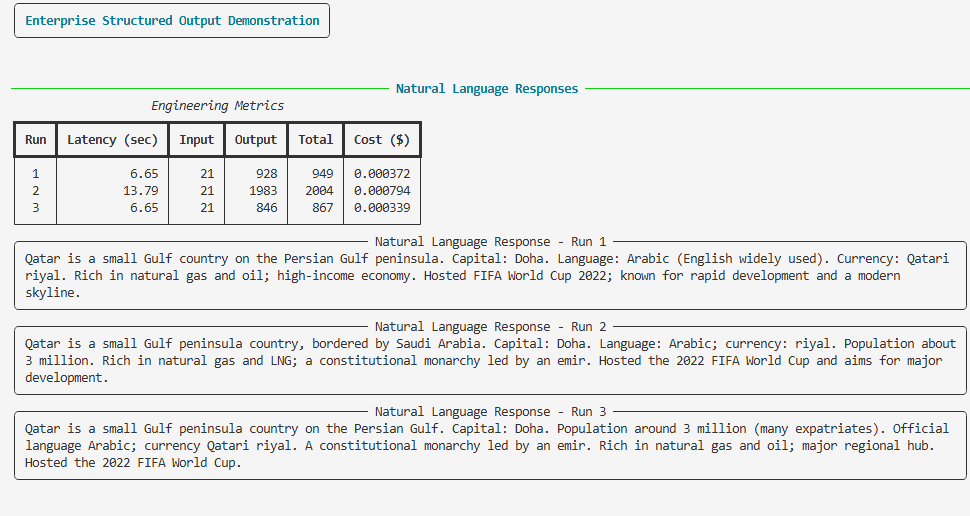
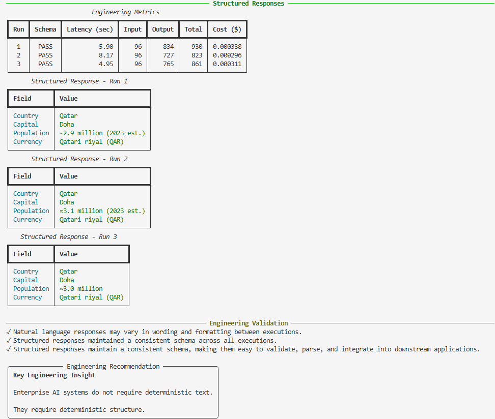

# Utility 06 – Structured Output

## Objective

Large Language Models naturally generate responses intended for human consumption. While these responses are easy to read, they are not always suitable for software systems that require predictable, machine-readable data.

This utility demonstrates how Structured Output enables enterprise applications to receive responses that conform to a predefined schema, making them easier to validate, parse, and integrate into downstream systems.

---

## Why Structured Output?

Enterprise AI applications often interact with multiple downstream systems such as:

- REST APIs
- Databases
- Workflow engines
- Automation platforms
- Reporting systems

Free-form natural language is excellent for humans but can be difficult for software to consume reliably.

Structured Output solves this problem by ensuring that responses conform to a predefined schema.

---

## Engineering Question

> How does enforcing a response schema improve the consistency and usability of LLM responses for enterprise applications?

---

## Solution Overview

The utility executes the **same prompt** multiple times using the same model.

The only difference between the two executions is the response format.

| Natural Language Response | Structured Response |
|---------------------------|---------------------|
| Same prompt | Same prompt |
| Same model | Same model |
| Human-oriented output | Schema-enforced output |
| Formatting may vary | Consistent schema |
| Designed for people | Designed for software |

This controlled comparison isolates a single engineering variable—schema enforcement.

---

## Architecture

```text
                     User Prompt
                          │
                          ▼
                 OpenAI Responses API
                          │
             ┌────────────┴────────────┐
             │                         │
             ▼                         ▼
     Natural Language          Structured Output
        Response                 (Pydantic Schema)
             │                         │
             ▼                         ▼
       Human Consumption      Software Consumption
```

---

## Response Schema

The structured response is validated using the following Pydantic model.

```python
class CountryInformation(BaseModel):
    country: str
    capital: str
    population: str
    currency: str
```

---

## Program Output

### Natural Language Responses

The following executions demonstrate that although the business question remains identical, the wording, formatting, and level of detail may vary between executions.



---

### Structured Responses

The same prompt executed using Structured Output consistently returns data that conforms to the expected schema.



---

## Engineering Observations

The experiment demonstrates several important engineering characteristics.

### Natural Language Responses

- Wording varies between executions.
- Formatting may change.
- Field ordering is not guaranteed.
- Additional information may appear or disappear.
- Responses are optimized for human readability.

### Structured Responses

- Schema remains consistent.
- Field names remain predictable.
- Responses are validated automatically.
- Applications can parse responses without relying on fragile text processing.
- Suitable for enterprise integrations.

---

## Production Use Cases

Structured Output is particularly valuable when integrating AI with enterprise systems.

Typical examples include:

- Incident Management
- Ticket Classification
- Financial Data Extraction
- Customer Support Automation
- Compliance Reporting
- Workflow Automation
- AI Agents
- Business Process Automation

---

## Engineering Takeaways

This utility highlights an important distinction when designing enterprise AI systems.

- Natural language responses are intended for people.
- Structured responses are intended for software.
- Enterprise applications require predictable schemas rather than predictable wording.
- Schema validation significantly simplifies downstream integration.

---

## Key Engineering Insight

> Enterprise AI systems do not require deterministic text.
>
> **They require deterministic structure.**

---

## Files

```
utilities/
    06_structured_output.py
    06_structured_output.md

prompts/
    06_country_information.txt

common/
    llm.py

assets/
    outputs/
        06_natural_language_response.png
        06_structured_response.png
```

---

## Related Utilities

- Utility 01 – Token Usage
- Utility 02 – Pricing
- Utility 03 – Model Comparison
- Utility 04 – Response Controls
- Utility 05 – Prompt Optimization

Structured Output naturally builds upon the optimization techniques introduced in previous utilities and prepares the foundation for upcoming topics such as Retry & Resilience, AI Observability, and Model Routing.