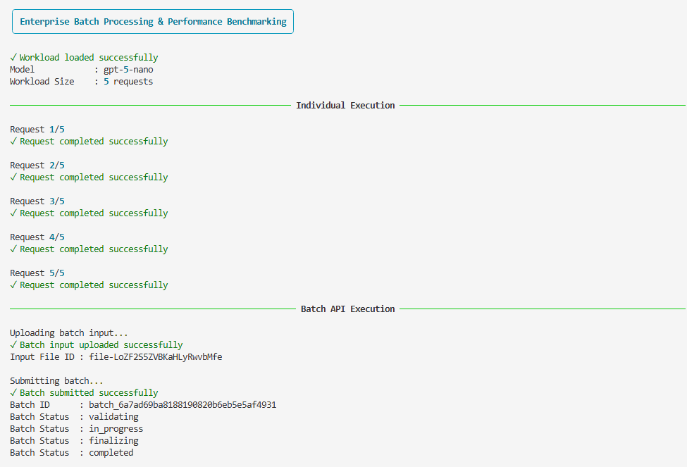
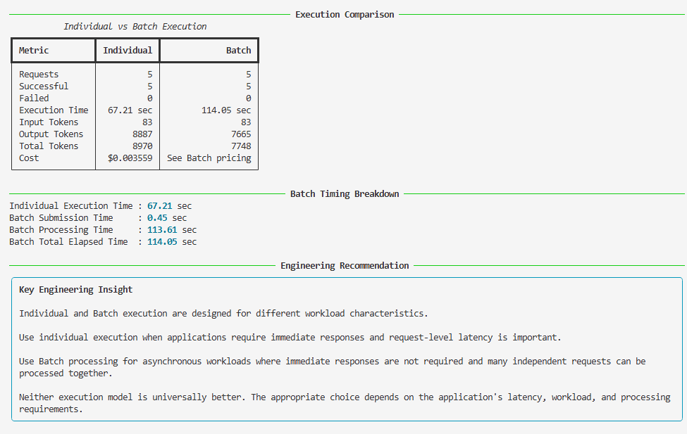

# Utility 08 – Batch Processing & Performance Benchmarking

## Objective

Enterprise AI applications can process LLM requests either as individual synchronous requests or as asynchronous batch workloads.

This utility compares both execution models using the **same workload, same model, and same prompts**, and captures engineering metrics for each approach.

The objective is not to determine which execution model is universally better, but to understand the characteristics and appropriate use cases of each.

---

## Engineering Question

> How do individual and Batch API execution differ when processing the same AI workload, and when should each execution model be used?

---

## Engineering Concepts

This utility demonstrates:

- Individual synchronous LLM execution
- OpenAI Batch API execution
- Asynchronous workload processing
- Batch execution lifecycle
- Request-level metrics
- Workload-level metrics
- Execution time measurement
- Token consumption
- Cost measurement
- Execution model comparison
- Use-case-based engineering decisions

---

## Experimental Design

The same five prompts are executed using two different execution strategies.

```text
                         SAME WORKLOAD
                          5 PROMPTS
                              │
                ┌─────────────┴─────────────┐
                │                           │
                ▼                           ▼
        Individual Mode               Batch Mode
        Responses API                 Batch API
                │                           │
                ▼                           ▼
        Synchronous Requests        Asynchronous Workload
                │                           │
                └─────────────┬─────────────┘
                              ▼
                         COMPARISON
                              │
                              ▼
                    Engineering Guidance
```

Keeping the workload constant allows the execution models to be compared using the same input conditions.

---

## Execution Models

### Individual Execution

Each prompt is submitted as an independent synchronous request.

```text
Prompt 1 → API Request → Response
Prompt 2 → API Request → Response
Prompt 3 → API Request → Response
Prompt 4 → API Request → Response
Prompt 5 → API Request → Response
```

This approach is appropriate when the application requires an immediate response from each request.

### Batch Execution

The same prompts are submitted as a single asynchronous Batch API workload.

```text
5 Prompts
    │
    ▼
JSONL Batch Input
    │
    ▼
Batch API
    │
    ├── validating
    ├── in_progress
    ├── finalizing
    └── completed
```

The application submits the workload and retrieves the batch status until processing reaches a terminal state.

---

## Metrics Captured

### Individual Execution

The utility captures:

- Number of requests
- Successful requests
- Failed requests
- Total execution time
- Input tokens
- Output tokens
- Total tokens
- Estimated cost
- Average request latency

### Batch Execution

The utility captures:

- Number of requests
- Successful requests
- Failed requests
- Batch submission time
- Batch processing time
- Batch total elapsed time
- Input tokens
- Output tokens
- Total tokens
- Batch execution status

---

## Sample Output

The execution output is captured in two screenshots because the complete console output is larger than a single screen.

### Part 1 – Execution and Batch Lifecycle



### Part 2 – Metrics and Engineering Recommendation



---

## Example Comparison

A typical execution produces a comparison similar to:

```text
Individual vs Batch Execution

Metric             Individual       Batch
------------------------------------------------
Requests           5                5
Successful         5                5
Failed             0                0
Execution Time     ... sec          ... sec
Input Tokens       ...              ...
Output Tokens      ...              ...
Total Tokens       ...              ...
Cost               ...              See Batch pricing
```

The utility also provides a Batch timing breakdown:

```text
Individual Execution Time : ... sec
Batch Submission Time     : ... sec
Batch Processing Time     : ... sec
Batch Total Elapsed Time  : ... sec
```

These measurements describe the execution characteristics of each approach; they are not intended to establish that one execution model is universally faster or better.

---

## Understanding the Results

The two execution models have fundamentally different operating characteristics.

### Individual execution

Individual execution provides:

- Immediate request-level responses
- Direct request/response interaction
- Request-level latency visibility
- Suitability for interactive applications

The trade-off is that every request is handled independently.

### Batch execution

Batch processing provides:

- Asynchronous workload submission
- Processing of multiple independent requests
- A batch-oriented execution lifecycle
- Suitability for workloads where immediate responses are unnecessary

Batch processing introduces asynchronous processing semantics, so its elapsed processing time should not be interpreted as equivalent to synchronous request latency.

---

## When to Use Each Model

| Requirement | Individual Execution | Batch Execution |
|---|:---:|:---:|
| Immediate response required | ✅ | ❌ |
| Interactive application | ✅ | ❌ |
| Request-level latency is critical | ✅ | ❌ |
| Large asynchronous workload | ⚪ | ✅ |
| Immediate response not required | ⚪ | ✅ |
| Independent requests can be processed together | ⚪ | ✅ |
| Workload can tolerate asynchronous completion | ⚪ | ✅ |

Neither execution model is universally better.

The appropriate choice depends on the application's workload characteristics and operational requirements.

---

## Engineering Recommendation

> **Individual and Batch execution are designed for different workload characteristics.**

Use **individual execution** when applications require immediate responses and request-level latency is important.

Use **Batch processing** for asynchronous workloads where immediate responses are not required and many independent requests can be processed together.

The execution model should therefore be selected based on:

- Latency requirements
- Workload characteristics
- Response requirements
- Processing model
- Operational constraints

---

## Key Takeaways

- The same AI workload can be executed using different execution models.
- Individual execution provides synchronous request/response behaviour.
- Batch processing provides asynchronous workload execution.
- Batch execution has its own lifecycle, including validation and processing stages.
- Request-level and workload-level metrics provide different engineering perspectives.
- Execution time should be interpreted in the context of the execution model.
- Neither individual nor Batch execution is universally better.
- The appropriate approach depends on the application's use case and operational requirements.

---

## Files

```text
utilities/
    08_batch_processing.py

prompts/
    08_batch_demo.txt
```

---

## Related Concepts

This utility builds on concepts introduced in earlier utilities:

- Token usage
- Cost estimation
- Model usage
- Engineering metrics
- Resilience
- Workload-level engineering

It extends the repository from analysing individual LLM requests toward analysing **AI workloads and execution strategies**.