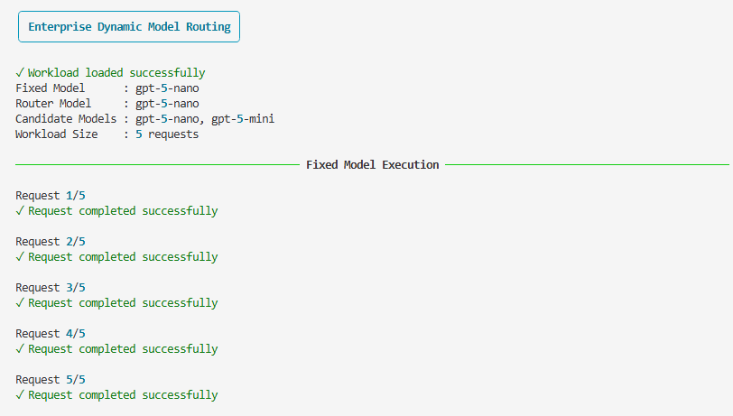
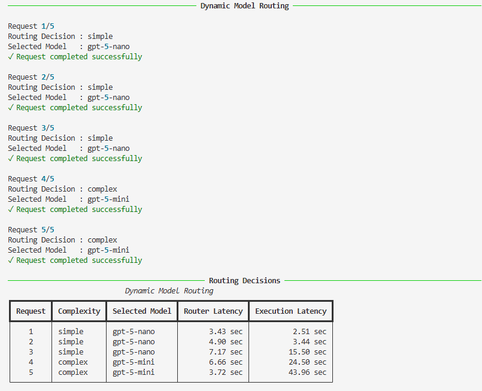
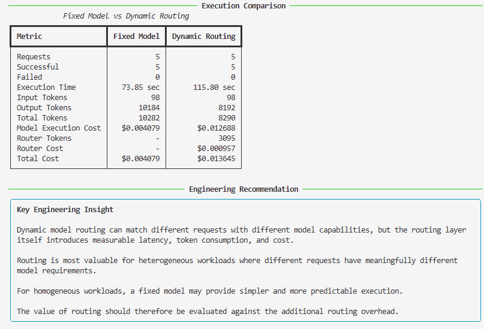

# Utility 09 – Dynamic Model Routing

## Objective

Enterprise AI applications may receive requests with very different reasoning and capability requirements.

Using the same model for every request is simple and predictable, but may not always be appropriate for heterogeneous workloads.

This utility demonstrates **LLM-based dynamic model routing**, where a routing model evaluates each request and dynamically selects an appropriate execution model.

The utility compares fixed-model execution with dynamic model routing using the **same workload, same prompts, and same execution environment**, and captures engineering metrics for both approaches.

The objective is not to determine which execution model is universally better, but to understand the characteristics, overhead, and appropriate use cases of dynamic model routing.

---

## Engineering Question

> Can an AI application dynamically select an appropriate model for each request, and is the routing overhead justified by the resulting execution characteristics?

---

## Engineering Concepts

This utility demonstrates:

- Fixed-model LLM execution
- LLM-based request classification
- Dynamic model routing
- Dynamic model selection
- Heterogeneous AI workloads
- Routing latency
- Model execution latency
- Router token consumption
- Router cost
- Model execution cost
- Total workload cost
- Execution model comparison
- Use-case-based model selection
- Routing overhead

---

## Experimental Design

The same five prompts are executed using two different execution strategies.

```text

                         SAME WORKLOAD
                          5 PROMPTS
                              │
                ┌─────────────┴─────────────┐
                │                           │
                ▼                           ▼
        Fixed Model Mode           Dynamic Routing Mode
                │                           │
                ▼                           ▼
          gpt-5-nano                   LLM Router
                                            │
                                            ▼
                                   Routing Decision
                                            │
                               ┌────────────┴────────────┐
                               │                         │
                               ▼                         ▼
                          gpt-5-nano                 gpt-5-mini
                               │                         │
                               └────────────┬────────────┘
                                            ▼
                                         Response
```
                                
## Sample Output

The execution output is captured in three screenshots because the complete console output contains workload execution, routing decisions, execution metrics, cost breakdown, and the engineering recommendation.

### Part 1 – Workload - Fixed Model Execution, Dynamic Model Routing, Routing Decisions,  Execution Comparison and Engineering Recommendation





---

## Example Routing Metrics

A typical execution produces routing information similar to:

```text
                            Dynamic Model Routing

Request    Complexity    Selected Model    Router Latency    Execution Latency
--------------------------------------------------------------------------------
1          simple        gpt-5-nano        3.80 sec          2.25 sec
2          simple        gpt-5-nano        3.16 sec          3.45 sec
3          simple        gpt-5-nano       11.54 sec         15.07 sec
4          complex       gpt-5-mini        5.33 sec         30.18 sec
5          complex       gpt-5-mini        4.70 sec         61.75 sec


## Engineering Recommendation

> **Dynamic model routing can match different requests with different model capabilities, but the routing layer itself introduces measurable latency, token consumption, and cost.**

Routing is most valuable for heterogeneous workloads where different requests have meaningfully different model requirements.

For homogeneous workloads, a fixed model may provide simpler and more predictable execution.

The value of routing should therefore be evaluated against the additional routing overhead.

The execution model should be selected based on:

- Workload characteristics
- Latency requirements
- Model capability requirements
- Cost constraints
- Operational complexity
- Application requirements

Neither execution strategy should be considered universally better.

---

## Key Takeaways

- The same AI workload can be executed using different model-selection strategies.
- Fixed-model execution provides a simple and predictable execution path.
- Dynamic routing uses an LLM to determine which model should process each request.
- Dynamic routing does not rely on hard-coded keyword classification.
- Different requests can be routed to different models based on their characteristics.
- The routing model itself consumes tokens and incurs cost.
- Routing introduces additional latency.
- Router cost and model execution cost should be measured separately.
- Dynamic routing is most relevant for heterogeneous workloads.
- Fixed-model execution may be preferable for homogeneous or latency-sensitive workloads.
- Neither execution strategy is universally better.
- Model selection should be driven by workload characteristics and application requirements.

---

## Files

```text
utilities/
    09_dynamic_model_routing.py

prompts/
    09_routing_demo.txt