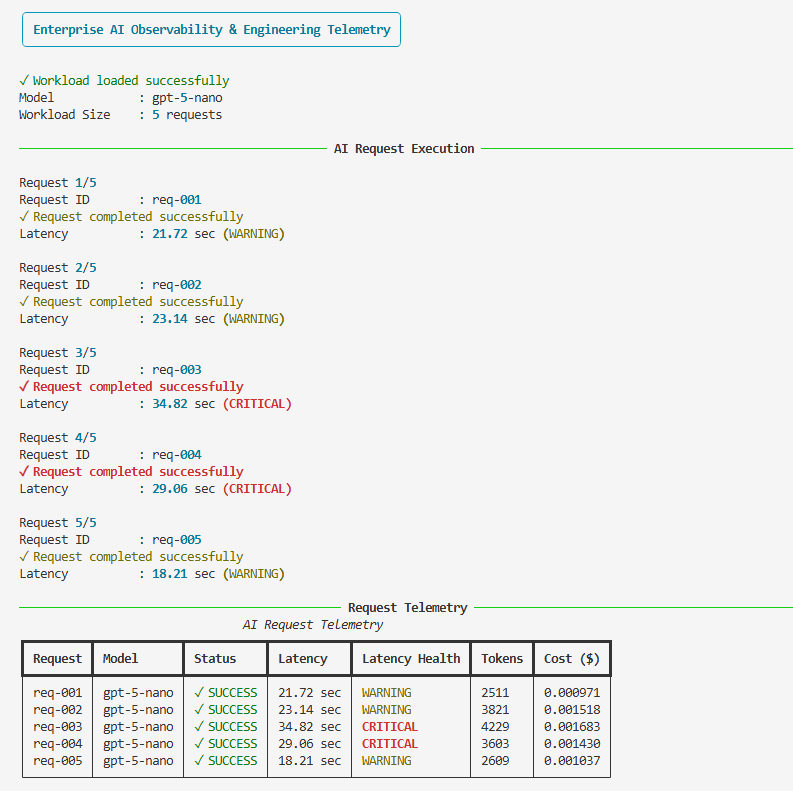
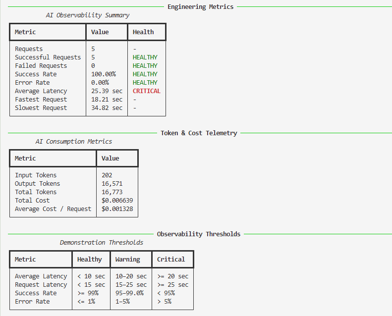
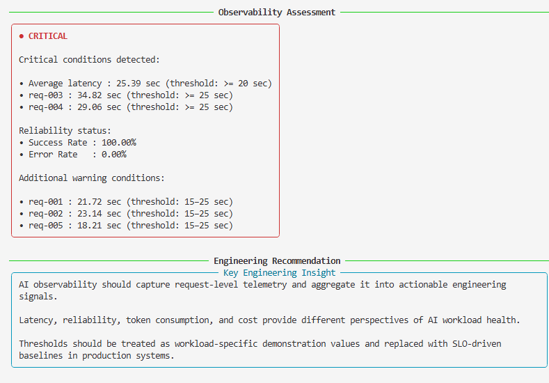

# Utility 10 – AI Observability & Engineering Telemetry

## Objective

AI applications introduce operational signals that extend beyond traditional application monitoring.

Latency, request success, token consumption, model usage, and estimated cost all provide important information about the health and behaviour of an AI workload.

This utility demonstrates how an AI application can capture request-level telemetry, aggregate it into engineering metrics, evaluate those metrics against configurable thresholds, and produce an actionable workload health assessment.

The objective is not to build a full observability platform, but to demonstrate the engineering foundation required to make AI workloads observable.

---

## Engineering Question

> How can AI applications capture request, model, performance, token, cost, and reliability telemetry and convert that telemetry into actionable engineering signals?

---

## Engineering Concepts

This utility demonstrates:

- AI request-level telemetry
- Model identification
- Request latency measurement
- Aggregate latency measurement
- Request success and failure tracking
- Success rate
- Error rate
- Token consumption
- Estimated AI workload cost
- Request-level health classification
- Workload-level health classification
- Configurable observability thresholds
- Healthy / Warning / Critical states
- Actionable threshold-breach reporting
- Engineering interpretation of AI telemetry

---

## Why AI Observability Matters

Traditional application monitoring commonly focuses on signals such as:

- CPU utilization
- Memory utilization
- Network traffic
- HTTP response time
- Application errors

AI applications introduce additional dimensions that can materially affect application behaviour and operating cost.

For example:

```text
                    AI APPLICATION
                          │
                          ▼
                    LLM REQUEST
                          │
             ┌────────────┼────────────┐
             │            │            │
             ▼            ▼            ▼
          Latency       Tokens        Cost
             │            │            │
             └────────────┼────────────┘
                          ▼
                     Reliability
                          │
                          ▼
                  Engineering Signal
```

An AI request can complete successfully while still exhibiting unacceptable latency or excessive token consumption.

Therefore:

> **Successful execution does not necessarily mean a healthy AI workload.**

This distinction is one of the key engineering lessons demonstrated by this utility.

---

## Experimental Design

The utility executes the same five-request AI workload and captures telemetry for every request.

```text
                         AI WORKLOAD
                        5 REQUESTS
                             │
                             ▼
                    ┌─────────────────┐
                    │    LLM API      │
                    └────────┬────────┘
                             │
                             ▼
                    Request Telemetry
                             │
          ┌──────────────────┼──────────────────┐
          │                  │                  │
          ▼                  ▼                  ▼
       Latency            Tokens              Cost
          │                  │                  │
          └──────────────────┼──────────────────┘
                             ▼
                    Aggregate Metrics
                             │
                             ▼
                     Threshold Evaluation
                             │
                  ┌──────────┼──────────┐
                  ▼          ▼          ▼
               HEALTHY    WARNING    CRITICAL
                             │
                             ▼
                  Engineering Assessment
```

The workload is intentionally small so that request-level behaviour can be clearly observed in the console output.

---

## Observability Architecture

The utility uses the existing shared LLM invocation capability rather than introducing another API integration.

```text
utilities/10_ai_observability.py
              │
              ▼
       common.llm.invoke_model()
              │
              ▼
          OpenAI API
              │
              ▼
       Response + Usage
              │
              ▼
      Observability Layer
              │
      ┌───────┼────────┐
      │       │        │
      ▼       ▼        ▼
   Latency  Tokens    Cost
      │       │        │
      └───────┼────────┘
              ▼
      Threshold Evaluation
              │
              ▼
      Health Classification
```

This separation is intentional.

The shared LLM utility provides reusable telemetry, while Utility 10 interprets that telemetry and turns it into observability signals.

---

## Telemetry Captured

### Request-Level Telemetry

For each request the utility captures:

- Request ID
- Model
- Request status
- Request latency
- Latency health classification
- Input tokens
- Output tokens
- Total tokens
- Estimated cost
- Error information when applicable

The request ID provides a simple correlation identifier that can later be extended into a larger logging or tracing system.

---

### Workload-Level Telemetry

The utility aggregates request-level telemetry into:

- Total requests
- Successful requests
- Failed requests
- Success rate
- Error rate
- Average latency
- Fastest request
- Slowest request
- Total input tokens
- Total output tokens
- Total tokens
- Total cost
- Average cost per request

This provides a workload-level view rather than looking at individual requests in isolation.

---

## Observability Signals

The utility focuses on four primary engineering signals.

### 1. Latency

Latency represents the time required to complete an LLM request.

The utility captures both:

- Individual request latency
- Average workload latency

This distinction is important because an individual slow request and a workload-wide latency degradation represent different operational conditions.

---

### 2. Reliability

Reliability is represented through:

- Successful requests
- Failed requests
- Success rate
- Error rate

For example:

```text
Success Rate : 100.00%
Error Rate   :   0.00%
```

A workload can therefore have excellent request reliability while simultaneously experiencing poor latency.

---

### 3. Token Consumption

The utility captures:

```text
Input Tokens
Output Tokens
Total Tokens
```

Token consumption is an important AI-specific operational signal because it can affect:

- Response generation
- Latency
- Model cost
- Workload scalability

---

### 4. Cost

The utility estimates:

```text
Total Cost
Average Cost / Request
```

Cost becomes particularly important when AI workloads scale from a handful of requests to thousands or millions of requests.

The cost shown by this utility is an engineering estimate based on the configured model pricing.

---

## Demonstration Thresholds

The utility applies configurable thresholds to demonstrate how raw telemetry can be converted into health signals.

| Metric | Healthy | Warning | Critical |
|---|---:|---:|---:|
| Average Latency | < 10 sec | 10–20 sec | >= 20 sec |
| Request Latency | < 15 sec | 15–25 sec | >= 25 sec |
| Success Rate | >= 99% | 95–99% | < 95% |
| Error Rate | <= 1% | 1–5% | > 5% |

### Important Note

These values are **demonstration thresholds only**.

They should not be interpreted as universal production standards for AI applications.

In a production environment, thresholds should be derived from:

- Application SLOs
- Historical workload behaviour
- User experience requirements
- Model characteristics
- Business requirements
- Capacity and cost constraints

---

## Health Classification

The utility classifies individual and aggregate metrics into three states.

### HEALTHY

The metric is within the configured healthy range.

```text
● HEALTHY
```

### WARNING

The metric has crossed a warning threshold but has not reached the critical threshold.

```text
● WARNING
```

### CRITICAL

The metric has crossed the configured critical threshold.

```text
● CRITICAL
```

The overall workload state is determined from the evaluated engineering signals.

A critical signal takes precedence over a warning signal.

---

## Sample Output

The complete console output is captured in three screenshots because the observability output contains multiple sections.

### Part 1 – Request Execution & Request Telemetry

This section shows:

- Workload information
- Individual request execution
- Request IDs
- Model
- Request status
- Request latency
- Latency health
- Token consumption
- Request cost



---

### Part 2 – Engineering & Consumption Metrics

This section shows:

- Aggregate engineering metrics
- Success and error rates
- Average latency
- Fastest and slowest request
- Input, output and total tokens
- Total cost
- Average request cost
- Demonstration thresholds



---

### Part 3 – Observability Assessment

This section shows:

- Overall workload health
- Critical threshold breaches
- Warning conditions
- Reliability status
- Engineering recommendation



---

## Example Engineering Metrics

A typical execution produces a summary similar to:

```text
AI Observability Summary

Metric                 Value          Health
------------------------------------------------
Requests               5              -
Successful Requests    5              HEALTHY
Failed Requests        0              HEALTHY
Success Rate           100.00%        HEALTHY
Error Rate             0.00%          HEALTHY
Average Latency        ... sec        CRITICAL
Fastest Request        ... sec        -
Slowest Request        ... sec        -
```

The same workload also exposes token and cost telemetry:

```text
AI Consumption Metrics

Metric                    Value
-----------------------------------------
Input Tokens              ...
Output Tokens             ...
Total Tokens              ...
Total Cost                $...
Average Cost / Request    $...
```

The actual values vary between executions because LLM response latency and output token generation can vary.

---

## Understanding the Results

One of the most important observations from this utility is that **reliability and performance are separate engineering signals**.

For example:

```text
Success Rate    : 100.00%   HEALTHY
Error Rate      :   0.00%   HEALTHY
Average Latency : 25.39 sec CRITICAL
```

This workload has no failed requests.

However, its latency has crossed the configured critical threshold.

Therefore, the workload is classified as:

```text
● CRITICAL
```

This does not mean the model API is failing.

It means that one of the configured observability signals has entered a critical state.

This is an important distinction for AI operations.

---

## Actionable Observability

The utility does not stop at displaying:

```text
● CRITICAL
```

It identifies the signals that caused the classification.

For example:

```text
Critical conditions detected:

• Average latency : 25.39 sec (threshold: >= 20 sec)
• req-003 : 34.82 sec (threshold: >= 25 sec)
• req-004 : 29.06 sec (threshold: >= 25 sec)

Reliability status:

• Success Rate : 100.00%
• Error Rate   : 0.00%
```

This is more useful than simply colouring a metric red.

The objective of observability is to help an engineer understand:

1. What happened?
2. Which signal changed?
3. Which threshold was breached?
4. Is the problem isolated or workload-wide?
5. Is reliability also affected?

---

## Telemetry vs Observability

Telemetry and observability are related but are not the same thing.

### Telemetry

Telemetry is the collection of signals such as:

- Latency
- Tokens
- Cost
- Status
- Errors

### Observability

Observability uses those signals to understand the internal state and behaviour of the system.

In this utility:

```text
Telemetry
   │
   ├── Latency
   ├── Tokens
   ├── Cost
   └── Reliability
          │
          ▼
   Threshold Evaluation
          │
          ▼
   Health Classification
          │
          ▼
   Engineering Assessment
```

The transition from raw telemetry to actionable engineering information is the central purpose of this utility.

---

## Why Request-Level and Aggregate Metrics Both Matter

A single aggregate number can hide important behaviour.

For example:

```text
Average Latency : 18 sec
```

does not reveal whether:

- Every request took approximately 18 seconds, or
- Four requests were fast and one request took 70 seconds.

Request-level telemetry provides the detailed view.

Aggregate telemetry provides the workload-level view.

Both are necessary for effective AI observability.

---

## Production Considerations

A production-grade AI observability implementation would normally extend this foundation with additional capabilities such as:

- Distributed tracing
- Correlation IDs
- Structured logs
- Metrics backends
- Time-series monitoring
- Dashboards
- Alerting
- SLO monitoring
- Error-budget tracking
- Prompt/version tracking
- Model version tracking
- Provider/API error classification
- Rate-limit telemetry
- Retrieval metrics for RAG systems
- Guardrail and safety signals
- Data-quality metrics
- Cost budgets and anomaly detection

These capabilities are intentionally outside the scope of this utility.

Utility 10 focuses on the engineering foundation: **capture → aggregate → evaluate → interpret**.

---

## Engineering Recommendation

> **AI observability should capture request-level telemetry and aggregate it into actionable engineering signals.**

Latency, reliability, token consumption, and cost provide different perspectives of AI workload health.

A successful request does not necessarily indicate a healthy AI application.

Similarly, a high latency signal does not necessarily mean that the model or API is unavailable.

Observability should therefore evaluate multiple signals together and provide enough context for engineers to understand the condition.

Thresholds should be treated as workload-specific demonstration values and replaced with SLO-driven baselines in production systems.

---

## Key Takeaways

- AI applications require observability beyond traditional infrastructure metrics.
- Request-level telemetry provides detailed visibility into individual AI requests.
- Workload-level metrics reveal aggregate application behaviour.
- Latency, reliability, token consumption, and cost are important AI engineering signals.
- A successful request can still contribute to an unhealthy workload.
- Thresholds convert raw telemetry into actionable health signals.
- Critical conditions should identify the specific metrics that caused the breach.
- Demonstration thresholds should not be treated as universal production standards.
- Production thresholds should be derived from SLOs, historical baselines, and business requirements.
- AI observability should move from **telemetry collection to actionable engineering insight**.

---

## Files

```text
utilities/
    10_ai_observability.py

prompts/
    10_observability_demo.txt

docs/
    10_ai_observability.md

assets/
    outputs/
        10_ai_observability_part1.png
        10_ai_observability_part2.png
        10_ai_observability_part3.png
```

---

## Related Concepts

This utility builds on several concepts introduced in earlier utilities:

- LLM invocation
- Model usage
- Token accounting
- Cost estimation
- Retry and resilience
- Batch processing
- Performance benchmarking
- Dynamic model routing
- Engineering metrics

It extends the lab from individual AI engineering capabilities toward **operational visibility of AI workloads**.

The next natural evolution is to connect these observability signals to persistent telemetry, dashboards, alerting, SLOs, and production monitoring platforms.
